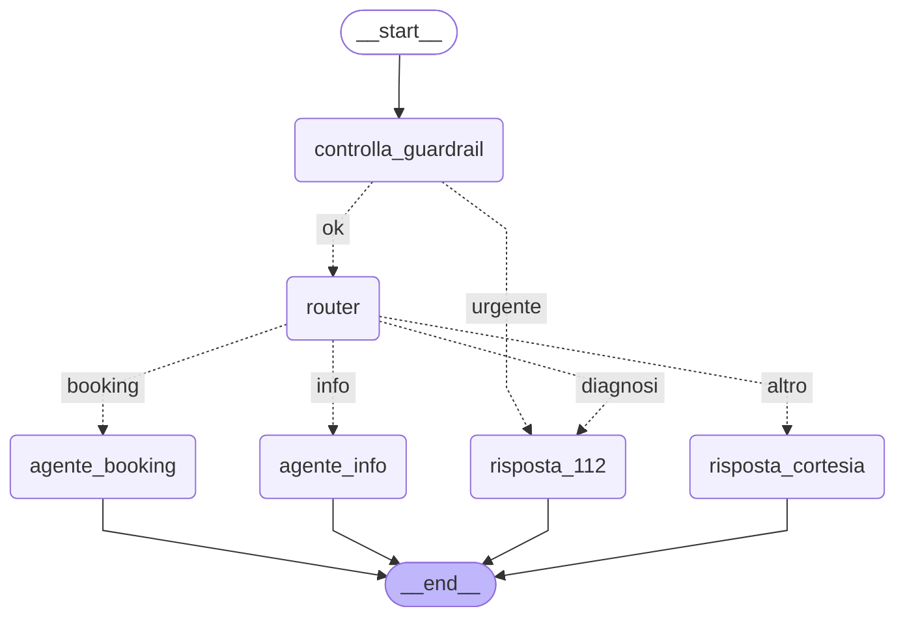

```mermaid
---
config:
  flowchart:
    curve: linear
---
graph TD;
	__start__([<p>__start__</p>]):::first
	controlla_guardrail(controlla_guardrail)
	router(router)
	risposta_112(risposta_112)
	agente_info(agente_info)
	agente_booking(agente_booking)
	risposta_cortesia(risposta_cortesia)
	__end__([<p>__end__</p>]):::last
	__start__ --> controlla_guardrail;
	controlla_guardrail -. &nbsp;urgente&nbsp; .-> risposta_112;
	controlla_guardrail -. &nbsp;ok&nbsp; .-> router;
	router -. &nbsp;booking&nbsp; .-> agente_booking;
	router -. &nbsp;info&nbsp; .-> agente_info;
	router -. &nbsp;diagnosi&nbsp; .-> risposta_112;
	router -. &nbsp;altro&nbsp; .-> risposta_cortesia;
	agente_booking --> __end__;
	agente_info --> __end__;
	risposta_112 --> __end__;
	risposta_cortesia --> __end__;
	classDef default fill:#f2f0ff,line-height:1.2
	classDef first fill-opacity:0
	classDef last fill:#bfb6fc

```
